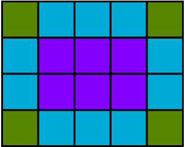
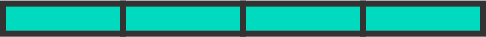
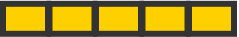
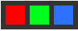

# Image Scores

This project is an assignment provided by Loblaw Digital, as part of the hiring process for a SRE role. 

## Getting Started

Once the repository has been cloned, you'd see a setup.py file in the root directory. Run it with the following command
```
python setup.py install
```
This will install all the dependencies and required libraries to run the project. 

### Prerequisites

These are the list of dependencies you'd find in the setup.py

```
python3
scikit-image
pandas
numpy
pillow
```

### Installing

Below are the commands to manually install the libraries. 

```
pip install scikit-image
```
```
pip install numpy
```
```
pip install pandas
```
```
pip install pillow
```
### Run the project
Once all the requisites are installed, execute the following steps.

* Proceed to *data* directory and run the generate_data.py file using the command ```python generate_data.py```. This will create a csv file called ```input.csv``` which contains the relative paths to all the images.

* Once the data has been generated, proceed to the src directory and run main.py using ```python main.py```. This will execute the entire project and create a file called ```output.csv``` in the src directory.

## File description
-```/data/generate_data.py```
This piece of code is used to create the input.csv file with two columns (image1, image2). It creates two lists each containing the relative paths for all images under image1 and image2 respectively. And writes the paths to the input.csv file for each row iteratively.

-```/image_matcher/read_image.py```
A RGB image is usually a 3 dimensional arrays 8-bit unsigned integers. The shape of the array would be  ``` height * width * 3```. Below is a 4 by 5 RGB image. Which means it contains, 4 lines of 5 pixels each. Each pixel contains 3 bytes (representing red, green and blue).



Our grid has 4 lines as below.



And each line has 5 pixels.



Finally, each pixel is a 3 byte rgb value.



Now what read_image does is, it extracts the pixel value in sequence for each image of any shape and stores them in a numpy array. I have used ```ImageSequence.Iterator``` provided by pillow library, which iterates over the image and extracts the pixel composition.

-```/image_matcher/score.py```
bjorn_score() takes two np arrays of two respective images to calculate the score based on structural similarity. The Structural Similarity Index (SSIM) is a perceptual metric that quantifies the image quality degradation that is caused by processing such as data compression or by losses in data transmission. SIM actually measures the perceptual difference between two similar images.
* If the shape(height*width*3) of image1 is not equal to shape of image2, the score would be 1 because the images are completely different. 
* If two images are perfectly similary, the score would be 0. 
* If two images are structurally similar, the score would be <0.1. 
* And for other cases, the ssim() from skimage(scikit-image) calculates the scores by taking in two np arrays which were passed as the parameters to the bjorn_score() function. 

-```/data/main.py```
This is the driver file. It reads the data from the input.csv file and makes a call to read_image and score functions for the respective values. Calculates the time for each score calculation and finally writes all the details to a file called output.py

### Other files
* Dockerfile is included which packages the code.
* requirements.txt for dependencies.

### Authors

* **Mohan Noolu** - *Work* - [ImageScores](https://github.com/M10han/image-scores)


### License

This project is licensed under the MIT License - see the [LICENSE.md](LICENSE.md) file for details

## Acknowledgments

* https://scikit-image.org/docs/
* pythoninformer - image processing with numpy.
